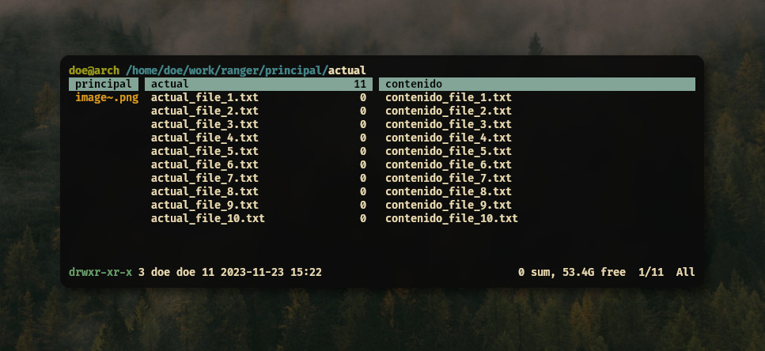
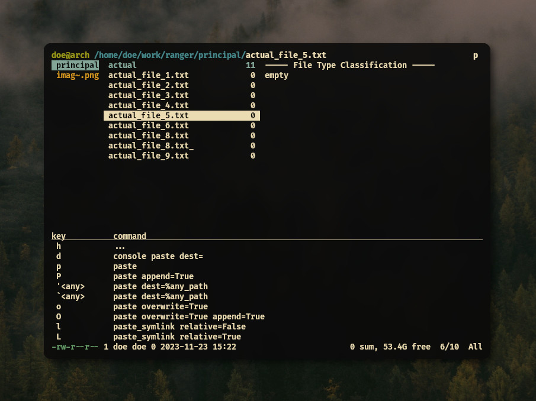

# Ranger: Administra tus archivos desde la terminal 
<b>By: <a href="https://github.com/msh-dv" target="_blank">Tony</a> - 23/11/2023</b>
<br>
<br>

Para la mayoría de usuarios usar los comandos `ls` y `cat` para visualizar los archivos y su contenido o `cp` y `mv` para copiarlos, moverlos o renombrarlos es más que suficiente, pero hoy vamos a ver una menera diferente y minimalista de hacerlo con ranger.

En esta breve guía veremos lo básico como su instalación, interfaz, atajos y configuración.


Ranger es un administrador de archivos minimalista basado en texto, escrito en Python y que usa combinaciones de teclas basadas en VI, así que sí estás familiarizado con [Vim](vim1.html) seguramente te resultara sencillo acoplarte a su uso.
Además de esto cuenta con `rifle` un poderoso lanzador de archivos, cuyo punto fuerte es que puede determinar automáticamente los tipos de archivos y con eso elegir que programa usar para abrirlos, sin necesidad de nuestra interacción. 

## Instalación

Aquí podrán encontrar varias formas de instalarlo dependiendo de su distribución:

**Arch Linux:**
```
sudo pacman -Sy ranger
```

**Debian / Ubuntu:** 
```
sudo apt install ranger
```

**Fedora:** 
```
sudo dnf install ranger
```

**Gentoo:** 
```
sudo emerge -U app-misc/ranger
```

**PyPI:** 
```
pip install ranger-fm
```

Si quieres instalarlo manualmente clonando el repositorio, puedes revisar el proceso [aquí](https://github.com/ranger/ranger#installing)

## Interfaz

La ventana principal muestra de manera predeterminada tres columnas (columnas de Miller):



- La columna de la izquierda muestra el directorio principal, con el directorio actual resaltado.
- La columna central muestra el directorio actual.
- La columna derecha muestra una previsualización del directorio seleccionado o de los archivos seleccionados.

En la parte superior podremos encontrar la ruta del directorio actual y en la parte inferior podremos ver los atributos del archivo actual.

Si ya tienes experiencia con Vim, entonces ya conoces algunas formas de trabajar con ranger, como usar las teclas `hjkl` para moverte entre directrios y archivos, así también comparte algunos modismos con Vim. Por ejemplo: `yy` (copiar), `pp` (pegar), `dd` (cortar). Puedes usar funciones más complejas desde la línea de comandos usando `:` como en Vim.

## Navegando en ranger

Como mencione anteriormente podemos usar las teclas de movmimiento de Vim o las flechas de movimiento:
```
    k    --- arriba
  h   l  --- izquierda o regresar / derecha o entrar
    j    --- abajo
```

La tecla `l` sirve para entrar a directorios, para ejecutar programas, abrir imagenes, etc.

Se puede usar `i` para inspeccionar un archivo, por lo que se pondra en pantalla completa, nos podremos desplazar por el y podemos volver a presionar `i` para salir de la inspección.
Podemos usar también `q` para salir de la inspección, o para salir de una pestaña activa o para salir del mismo ranger.

## Atajos de teclado y sugerencias

Se pueden hacer muchos comandos utilizando sus atajos de teclado, haciendo uso de las sugerencias.
Las sugerencias se muestran cada vez que al presionar una tecla hay multiples acciones disponibles como:

`g` para la navegación y pestañas, `r` para el comando `:open_width`, `y` para copiar y `d` para cortar/eliminar.<br> 
`p` para `paste` (pegar).<br>
`o` para ordenar.<br>
`.` para filter_stack.<br>
`z` para cmabiar ajustes, `u` para deshacer.<br>
`M` para linemode.<br>
`+,-,=` para establecer los derechos de acceso a archivos.<br>

Las sugerencias consisten en teclas del lado izquierdo y su comando correspondiente de lado derecho



## Configuración básica

Ranger usa 4 archivos de configuración principales:

- `rc.conf` es utilizando para varias opciones de configruación y atajos de teclado a funciones (más adelante veremos como habilitar la previsualización de imagenes).
- `rifle.conf` decide qué programa se utiliza para abrir los archivos.
- `scope.sh` es un shell script utilizado para generar previsualizaciones para varios tipos de archivos.
- `commands.py` contine varias implementaciones de funciones, escritas en Python, utilizadas para modificar el comportamiento de `ranger` e implementar tus propios comandos.


