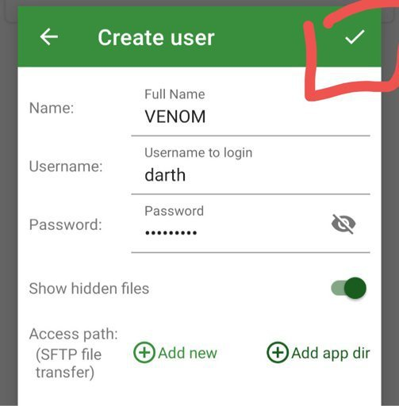
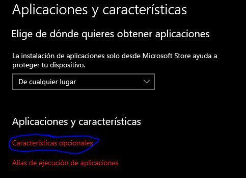
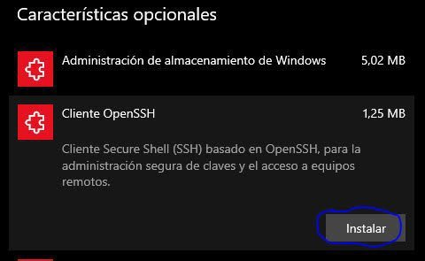
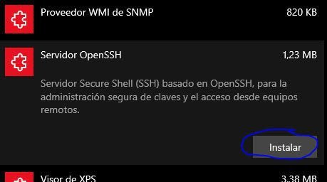
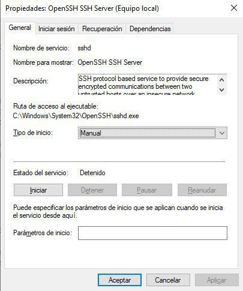
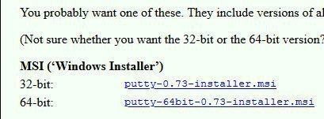

# SSH - Guía completa
<b>By: Darth Venom - 14/01/2021</b>
<br>
<br>
## Índice

- [Introducción](#introducción)
- [Crear un servidor SSH en GNU/Linux](#crear-un-servidor-ssh-en-gnulinux)
- [Crear un servidor SSH en Android](#crear-un-servidor-ssh-en-android)
- [Crear un servidor SSH en Windows](#crear-un-servidor-ssh-en-windows)
- [Conectarse a SSH desde GNU/Linux](#conectarse-a-ssh-desde-gnulinux)
- [Conectarse a SSH desde Android](#conectarse-a-ssh-desde-android)
- [Conectarse a un server hecho en Android](#conectarse-a-un-server-hecho-en-android)
- [Conectarse a SSH desde Windows](#conectarse-a-ssh-desde-windows)
- [Conectarse a un server hecho en Windows](#conectarse-a-un-server-hecho-en-windows)
- [Subir o Descargar archivos mediante SSH](#subir-o-descargar-archivos-mediante-ssh)

## Introducción

*En este blog vamos a introducir SSH y ampliaremos bastante respecto al tema. Para este tutorial me pareció bien hacerlo multiplataforma, porque si bien en otros tutoriales excluí a Windows porque las cosas se hacen por GUI y tendría que mostrar fotos (no uso Windows), en este tutorial en especial los procedimientos no son iguales, pero eso lo veremos más adelante.*

**SSH** o Secure Shell, es uno de los protocolos por el cual se puede establecer conexión a un servidor por medio de un canal seguro donde la información se transmite cifrada.

Este protocolo trabaja de un modo similar a como lo hace Telnet, solo que **SSH** es mucho más seguro ya que como la información viaja cifrada no es legible y se evitan intercepciones.

**SSH** posee varias funciones, entre ellas se encuentran, conexión remota, manipulación de archivos remotos, gestión de bases de datos y transferencia de archivos.

*Está claro que para poder conectarnos a un server SSH propio, antes tenemos que saber cómo crearlo, así que comenzaremos con la explicación.*

## Crear un servidor SSH en GNU/Linux

Para crear un server tendremos que [instalar el paquete openssh](term3.md).

Una vez instalado, hay que iniciar el servicio. Para esto se usa:
```
sudo systemctl start sshd
```
Mientras el server esté conectado podremos acceder a él desde la red local. Para comprobar que lo esté, podemos usar el comando: 
```
sudo systemctl status sshd
```
Si quisiéramos detenerlo usaríamos:
```
sudo systemctl stop sshd
```
Con esto el server ya estaría corriendo con la configuración predeterminada. Si el usuario desea cambiar algo de la configuración debe tener en cuenta que las preferencias se encuentran en `/etc/ssh/sshd_config` o en `~/.ssh/config`.

## Crear un servidor SSH en Android

Para crear un servidor SSH en Android no usaremos ni Termux ni Userland, ambos programas suelen dar errores o ni siquiera dan resultados. En Userland cuando se inicia el server no muestra ningún error y parece arrancar correctamente, pero si se chequea el status muestra que el server no se inició en ningún momento. Por estas razones es que usaremos una aplicación llamada 'SSH server', puede ser descargada desde la play store con el siguiente link: <https://play.google.com/store/apps/details?id=net.xnano.android.sshserver>.

*Una vez instalada la aplicación procederemos a abrirla y configurarla.*

Nos pedirá permiso para acceder a nuestro almacenamiento. Nosotros debemos aceptar.

Luego vamos a la sección de Users.


Una vez ahí añadimos un nuevo usuario


Cuando hayamos finalizado guardamos los cambios.



Para iniciar el server debemos presionar el botón *start* en la sección *home*.


Bien, con eso ya podremos conectarnos a nuestro server **SSH** desde la red local, eso es importante, **se debe estar en la misma red que el server para conectarse a él**.

La dirección de nuestro server se ve aquí


En mi caso, la foto dice que mi IP, la IP por dónde está corriendo el SSH, es *192.168.0.55* y que el puerto es *2222*. Estos datos son importantes a la hora de conectarse a un server, más abajo mostraré cómo hacerlo.

## Crear un servidor SSH en Windows

Respecto al SSH en Windows, mientras sea Windows 10, ya podremos usar el SSH tranquilamente desde la terminal o cmd (símbolo del sistema). SSH en Windows funciona como una característica opcional, lo que significa que hay que activarlas para usarlas. Son dos las características, el **OpenSSH Client** y el **OpenSSH Server**. Por defecto en las versiones más recientes suele venir activada la caraterística **OpenSSH Client**.

Con **OpenSSH client** podremos conectarnos a SSH y con **OpenSSH Server** podremos permitir que se conecten a nuestro PC. Para activar estas características abriremos `configuración>Aplicaciones>Aplicaciones` y `características>Características opcionales>Agregar una característica`








*(Para los que deshabilitan el servicio de windows update: No pueden añadir características mientras ese servicio esté deshabilitado)*

Una vez se haya terminado de instalar, tendremos que tener en cuenta que el servidor SSH lo podremos encontrar como un servicio, los servicios pueden iniciarse y detenerse desde la aplicación de servicios. Para acceder a ella presionamos `HOME+R`. Nos saldrá una ventana, en ella escribimos `services.msc` y le damos enter.

Una vez hayamos ingresado a services.msc buscaremos en la lista el servicio **OpenSSH SSH Server**. Le damos click derecho y seleccionamos **propiedades**.

En el apartado de "Tipo de inicio" podemos seleccionar Manual o Automático. Luego presionamos el botón de **Iniciar** para que el server se inicie y por supuesto podemos detenerlo con el botón **Detener**.



*En este punto el server ya estará funcionando y podremos conectarnos a él.*

## Conectarse a SSH desde GNU/Linux

Conectarse a SSH en este caso será bastante fácil, primero abriremos una terminal, en la mayoría de los entornos de escritorio la combinación es `CTRL+ALT+T`. Si esa combinación no abre la terminal, puede encontrarse en el menú de aplicaciones.

Una vez en la terminal usaremos el comando `ssh`. La sintaxis es la siguiente:
```
ssh usuario@hostname
```
Teniendo en cuenta que la IP privada del server es *192.168.0.55* y el usuario es *darth*, usaría el comando `ssh darth@192.168.0.55`. Tras haberlo ingresado me pedirá una contraseña, que en este caso será la contraseña de nuestro usuario remoto, la ingresamos y le damos a enter.

Una vez hayamos seguido todos los pasos ya nos abremos conectado al server.

En el caso de que no puedan conectarse al server, intenten especificando el puerto. Teniendo en cuenta que el puerto es *2222*, sería así: 
```
ssh darth@192.168.0.55 -p 2222
```

## Conectarse a SSH desde Android

Para conectarnos a SSH el proceso será igual que en Linux, podemos usar cualquier emulador de terminal. Pueden seguir los mismos pasos de la sección anterior.

Una alternativa a la terminal en Android es la aplicación **JuiceSSH**, muy buena. Permite conectarnos a SSH y administrar las conexiones desde ahí, la diferencia con la terminal es que **JuiceSSH** ofrece una conexión aún más sencilla, esto es porque cuenta con una interfaz gráfica. Esto no lo hace mejor, solo lo hace más sencillo.

Un dato más es que **JuiceSSH** es bastante personalizable. El link para descargarlo es este: <https://play.google.com/store/apps/details?id=com.sonelli.juicessh>

## Conectarse a un Server hecho en Android

Para crear un server en Android revisen la sección de [Crear un server en android](#crear-un-servidor-ssh-en-android) de este mismo blog.

Para conectarnos a un server hecho en Android con los pasos de este blog tendremos que usar el nombre de usuario que creamos, como mostré en las fotos, el mío es 'darth'

Como se describe en la sección anterior, se pueden conectar mediante un emulador de terminal con el comando `ssh` o mediante la aplicación JuiceSSH (enlace en la sección anterior). Para conectarnos vamos a la app del server y vemos en la parte de arriba donde dice `<user>@192.168.xx.xx:2222` Ese `192.168.xx.xx` será su dirección IP o *hostname*, y el `:2222` significará que el puerto en el que está corriendo el server es *2222*.

Desde un emulador de terminal, en mi caso sería `ssh darth@192.168.0.55 -p 2222`. Desde el JuiceSSH tendría que poner solo `darth@192.168.0.55:2222`. En ambos casos luego me pedirá la contraseña del usuario que establecimos para luego poder conectarnos.

## Conectarse a SSH desde Windows

Como vimos en la sección [Crear un servidor SSH en Windows](#crear-un-servidor-ssh-en-windows), deberemos activar las características opcionales de **OpenSSH** (tutorial en la sección de [Crear un servidor SSH en Windows](#crear-un-servidor-ssh-en-windows)). Una vez lo hayamos hecho probablemente necesitemos reiniciar y luego el comando `ssh` estará disponible en el cmd.

Para conectarnos a SSH desde Windows podemos usar la terminal o mejor conocida como cmd (símbolo del sistema), o se puede usar el cliente *Putty* que ofrece una interfaz gráfica. La diferencia entre putty y el cmd en cuanto a calidad es ninguna, pero Putty es más sencillo por el simple hecho de usar interfaz gráfica.

Si quieren usar Putty pueden descargarlo desde: <https://www.chiark.greenend.org.uk/~sgtatham/putty/latest.html>

Entran al link y van hacia donde dice *"MSI (Windows installer)"*, ahí verán dos links, uno para los equipos de 32 bits y otro para los de 64, cliquea el correspondiente. Una vez finalizada la instalación van a la carpeta de Descargas y ejecutan el instalador.



Para los que quieran usar el cmd los pasos son los mismos que los descritos en la sección '
[Conectarse a SSH desde Linux](#conectarse-a-ssh-desde-gnulinux) del blog. Si por alguna razón no pueden conectarse mediante `ssh user@hostname`, recuerden especificar el puerto de la siguiente forma:
```
ssh user@hostname -p port #(reemplazan port por el puerto del server).
```

## Conectarse a un Server hecho en Windows

Para conectarse a un server hecho en Windows deben utilizar el nombre de usuario con el que se haya iniciado sesión en windows y la contraseña del mismo, no el pin, la contraseña. Más específicamente la contraseña de la cuenta de outlook que hayan vinculado con Windows. Teniendo eso en cuenta, pueden seguir los mismos pasos que en la sección [Conectarse a SSH desde Linux](#conectarse-a-ssh-desde-gnulinux) de este blog.

## Subir o Descargar archivos mediante SSH

Para subir o descargar archivos, usaremos `scp`, este metodo es bidireccional, lo que significa que podremos compartir archivos desde el dispositivo hasta el server (subir) y desde el server hasta el dispositivo (descargar).

Usualmente cuando arrancamos el server SSH en Linux y en Windows, este escucha en el puerto 22, y cuando usamos el comando ssh o scp, el puerto por defecto al que se conecta es 22, esa es la razón por la que en algunos casos no hace falta especificar el puerto del server al que queremos conectarnos.

La sintaxis de scp si no especificamos puerto es:
```
scp user@hostname:/ruta/en/server /ruta/de/origen/
```

Por ejemplo:
```
scp darth@192.168.0.55:/home/darth/File /sdcard/File
```

En el ejemplo anterior se conecta al server *192.168.0.55* con el usuario *darth* y se transfiere el archivo `File` desde el directorio `/home/darth/` (del server) hasta el directorio `/sdcard/` de un celular que se usó para este ejemplo.

Si en vez de querer descargar un archivo del server queremos subirlo, solo debemos invertir la sintaxis de la siguiente forma:
```
scp /sdcard/File darth@192.168.0.55:/home/darth/File
```
En este ejemplo se transiere el archivo `File` ubicado en el directorio `/sdcard/` hacia el directorio `/home/darth/` ubicado en el server *192.168.0.55*, nos conectamos con el usuario que en este caso es *darth*.

Si tuvieramos que especificar el puerto, la sintaxis sería la siguiente:
```
scp -P 2222 user@hostname:/origen /destino
```
En este caso transferimos archivos, pero conectados en el puerto *2222*. Es importante que la `-P` esté en mayúsculas.
<br>
<hr>
*El post ha llegado a su fin. Si tienes dudas puedes contactarme en Discord. Soy venom_instantdeath.*
