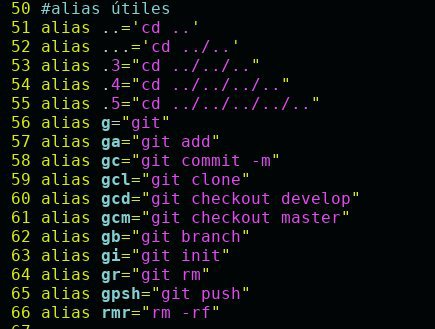
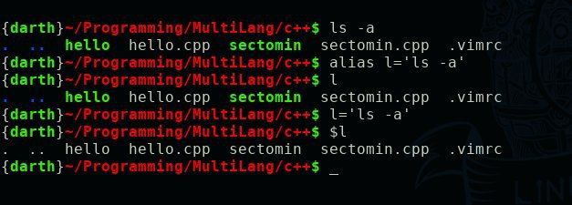
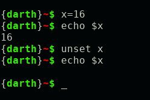

# Bash::Manejando la Terminal - De 0 a 1000 #3
<b>By: Darth Venom - 18/12/2020</b>
<br>
<br>
*En este capítulo hablaremos acerca de dos cosas, alias y variables. Son similares pero se usan para distintas cosas bastante específicas.*

Los aliases son nombres alternativos que el usuario puede darle a los comandos para llamarlos de una forma más sencilla y/o conveniente. Por ejemplo, en vez de escribir algo largo como:
```
ls -Fla --color=auto
```
Se puede simplificar con un alias más corto como `ll`. En vez de escribir todo eso, se podría escribir `ll` y el resultado sería el mismo que ese comando.

La sintaxis para crear un alias es muy simple:
```
alias NombreDeAlias="comando"
```
Para entenderlo mejor vamos a declarar el alias `ll` del que hablamos anteriormente:
```
alias ll="ls -Fla --color=auto"
```
*Tras usar este comando el alias está configurado y funcionará únicamente dentro de la sesión de bash desde la cual se declaró dicho alias. Para dejar un alias configurado permanentemente el usuario puede querer referirse al archivo de configuración de bash (.bashrc), el cuál se encuentra en el directorio home. Si el usuario desconoce cuál es la ruta del directorio home puede consultarlo con el siguiente comando:*
```
echo $HOME
```
Los archivos de configuración se revisarán en el próximo blog.

Ejemplos de alias útiles:



A parte de los alias también es menester conocer las variables. Anteriormente se mencionó una variable de entorno: `$HOME`. Las variables son un elemento en el cuál se pueden guardar datos de cualquier tipo, tienen un espacio reservado en la memoria (RAM) y poseen un identificador, el identificador se lo da el mismo programador. Se llaman variables porque el valor que contienen puede cambiar indefinidamente.

*Supongamos que Juán tiene 28 años y se quiere guardar ese dato en una variable, la sintaxis para declarar una variable es la siguiente:*
```
Identificador=Valor
```
El identificador lo inventamos nosotros, las únicas reglas respecto al nombre de las variables es que no pueden empezar con un número, no pueden contener símbolos y son sensibles a las mayúsculas, así que var no es lo mismo que Var.
```
edad=28
```
Así es como se declara la variable `edad`, es una variable que contiene el número 28. Si queremos hacer referencia a una variable debemos anteponer el nombre de la variable con un '$'.

Si tenemos el comando: `ls -la` y declaramos el alias `l`
```
alias l="ls -la"
```
Y a parte declaramos la variable `l`
```
l="ls -la"
```
A la hora de ejecutar el comando, usar el alias o la variable dará el mismo resultado, sólo que las variables no están hechas para ser usadas como alias sino para guardar datos.



En bash tanto las variables como los alias pueden ser redeclarados. Lo siguiente es algo que en ciertos otros lenguajes puede sonar impensable, las variables y los alias pueden ser eliminados, descargados de la memoria. Para hacer esto se usan los comandos `unset` para borrar variables y `unalias` para borrar alias.



En el ejemplo, tras borrar la variable se puede ver que al intentar imprimir su contenido no sale nada, queda un espacio; esto es el comportamiento predeterminado de bash, los programadores podrían querer prevenir este comportamiento ya que puede derivar en errores de programación en scripts. Para desactivar este comportamiento se puede usar alguno de estos dos comandos:
```
set -u
set -o nounset
```
En un próximo capítulo se ahondará acerca de las variables y su manipulación, sobre los aliases no hay más que lo visto en este capítulo, es algo sencillo y útil.
<br>
<hr>
*El blog ha llegado a su fin. Si tienes dudas puedes contactarme en Discord. Soy venom_instantdeath.*
